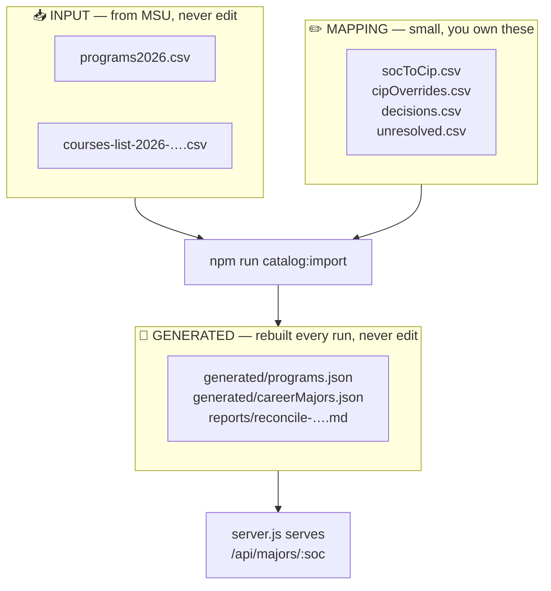
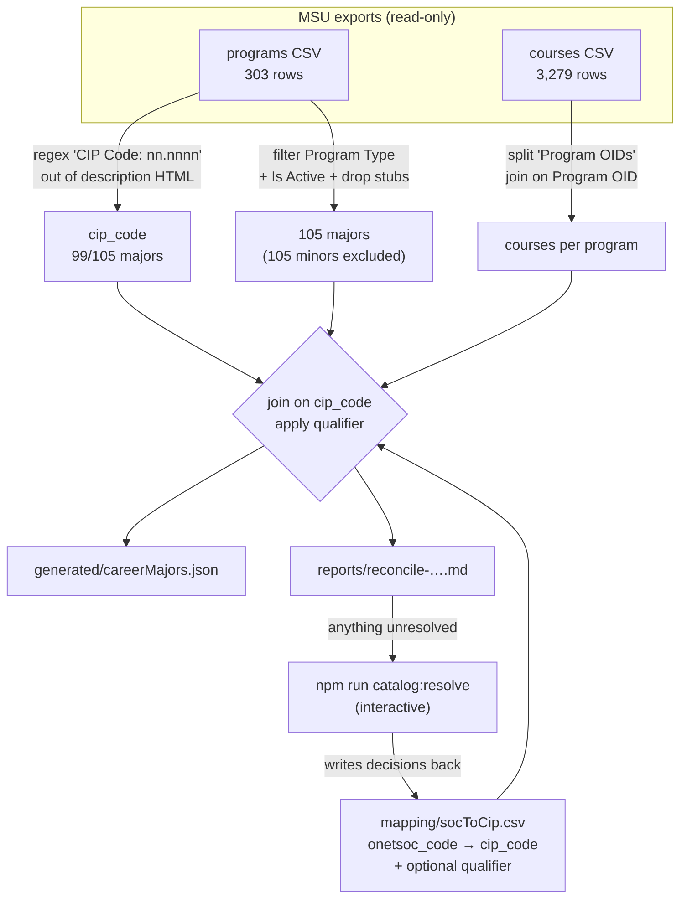

# Data Conversion Pipeline

How MSU's official catalog exports become the "MSU majors" shown under each
recommended career.

> **New here? Read Part 1 only.** It is the whole job in about a page.
> Part 2 exists for whoever has to change the pipeline rather than run it.

---
---

# Part 1 — Simple explanation

## What it does

The quiz gives a student a RIASEC score, which leads to careers. This pipeline
supplies the last step — the real MSU majors behind each career.


## What you run

Once a year, when MSU sends new catalog exports:

```bash
cd Backend
# 1. drop the new CSVs into data/  (do not rename or edit them)
npm run catalog:import     # rebuilds everything, prints a report
npm run catalog:resolve    # only if the report says something needs a decision
npm run catalog:import     # re-run to pick up your decisions
```

That is it. `catalog:import` is automatic. `catalog:resolve` asks you questions
only about things it genuinely cannot work out, and remembers your answers
forever.

## The three kinds of files



| Folder | Rule |
|---|---|
| `data/*.csv` from MSU | **Read-only.** Never edit, rename, or clean these up. |
| `data/mapping/` | The only files a human edits. Small and stable. |
| `data/generated/` | Delete it any time; `catalog:import` rebuilds it. |

## What the report tells you

Every run writes `data/reports/reconcile-<catalog>.md`. If every section says
`None`, you are done. If not, each entry names what changed and what to do —
and anything needing a decision points at `npm run catalog:resolve`.

## If something goes wrong

| Symptom | Meaning |
|---|---|
| `FAILED: CIP coverage … below 90%` | MSU changed the description template. The CIP is scraped out of HTML. Fix `extractCipCode` in `lib/catalog.js`. |
| `FAILED: Careers with >=1 major fell from …` | The new catalog broke a lot of links. Read the report before committing. |
| `No Programs export found` | The CSV in `data/` is missing the expected columns. |
| `stdin is not a TTY` | `catalog:resolve` was run by a script. It must be run by a person, in a terminal. |

**The failure that matters is a silent one**, so the importer deliberately exits
non-zero rather than quietly producing an empty mapping.

---
---

# Part 2 — Detailed explanation

## Why it is built this way

The previous approach scraped the MSU website for major names and URLs, then
joined careers to majors **by matching name strings**. It broke:

- the scrape captured 130 programs; the real catalog has 303
- 60 career→major rows pointed users at `https://www.msudenver.edu/events/`
- only 89 distinct URLs backed 3,385 rows
- program names drift between catalogs, so the join decayed every year

The fix is not a better scraper. It is **keying on identifiers that MSU does not
re-issue.**

## The key choice

Everything in the exports that looks like a primary key is scoped to one
catalog. Both files are stamped `Catalog OID = 59` (2026-2027), and the 303
programs occupy one contiguous OID block, 13463–14014. `Program Code` is
populated on **1 of 303 rows**, so it is not a fallback.

| Identifier | Durable across catalogs? | Used for |
|---|---|---|
| `Program OID` | ❌ Probably re-issued yearly | Joining courses↔programs **inside one run**, then discarded |
| `Program Code` | ❌ Empty | Nothing |
| `Program Name` | ❌ Drifts | Display, and fuzzy matching in the resolver |
| **`cip_code`** | ✅ NCES national standard | **The bridge. Persisted.** |
| **`Prefix`+`Code`** (`AAS 1010`) | ✅ Stable | Course identity |
| **O\*NET SOC** | ✅ National standard | Career identity |

**Rule: nothing catalog-scoped is ever written into a file a human maintains.**
A `Program OID` in `mapping/` would silently break every link next year — the
import would succeed and the results would be empty.

> ⚠️ Whether OIDs are actually re-issued cannot be proven from a single catalog.
> The importer checks it automatically the first time a second catalog exists
> and prints the answer under **Program OID drift** in the report.

## Full flow



## The qualifier rule

CIP is **not unique**: 83 distinct CIPs cover 99 majors, and 15 CIPs are shared.
Joining on CIP alone would merge programs that are not the same thing.

The seed decides automatically, per CIP:

| Situation | Qualifier | Result |
|---|---|---|
| Every program on that CIP normalizes to the **same name** | *blank* | All variants surface — correct for `Chemistry B.S.` + `B.A.` |
| The CIP also holds a **differently-named** program | that program's name | The distinction survives |

This is why it works without human input: the seed matched a legacy name to a
*specific* program, so it already knows which one was meant.

The clashes it protects against are real:

```
52.0299 → Operations Management + Brewery Operations   ← not remotely the same
52.0201 → Business Administration + Management + International Business
11.1003 → Computer Security + Cybersecurity
15.0613 → Advanced Manufacturing Sciences + Operations
51.0701 → Health Care Management + Aging Services Leadership
30.1901 → Nutrition and Dietetics + Nutrition Science
```

Verified: 60 careers map to Operations Management, and **none** of them receive
Brewery Operations.

## Where the mapping came from

`career_to_major_mapping.csv` (3,424 rows, 96 distinct major names) is
hand/AI-authored career→major judgement, and is the most valuable data in the
repo. `seedMapping.js` re-keyed it from names onto CIP **once**:

| Outcome | Count |
|---|---|
| Auto, blank qualifier | 73 |
| Auto, qualified | 14 |
| Needed a human | 9 |

The 9 were three different problems, which is why the resolver cannot assume the
answer is always "pick a major":

- **valid major, no CIP** — Aviation Management, Aviation Science, Elementary Education
- **normalizer gap** — handled by fuzzy search
- **no longer a major** — Integrative Health Care and Lifestyle Medicine are now
  *minors*; Film Studies and Production and Health Care Professional Services are
  retired outright

> The NCES CIP↔SOC crosswalk was considered as a replacement and rejected: it is
> deliberately many-to-many, mapping one SOC to dozens of CIPs, and would give
> noticeably worse recommendations than the curated mapping. It is useful as a
> validator, not a source.

## The resolver

`npm run catalog:resolve` is the only interactive piece.

```
Unresolved 4/9:  "Lifestyle Medicine"
   no name match in catalog
   affects 10 mapping rows across 10 careers

   1  Lifestyle Medicine Minor            [Minor]     51.9999  0.84
   2  Literature Minor                    [Minor]     23.1401  0.16
   3  Sport Media Minor                   [Minor]     09.9999  0.15

   [1-6] pick   [c] enter CIP   [r] retire   [s] skip   [q] save+quit  >
```

Design points that are easy to undo by accident:

- **Candidates span every program type, not just majors.** Programs demoted from
  major to minor between catalogs would otherwise look like plain misses and get
  mapped to the wrong thing. Each row is labelled `[Major]` / `[Minor]` /
  `[Cert]` / `[Licensure]` so nobody promotes a minor without seeing it.
- **`[r] retire` is a first-class answer.** Not every name has a right answer.
- Picking a program with no CIP prompts for one and records it in
  `cipOverrides.csv`.
- **Every answer is written to `decisions.csv`** and never asked again. This is
  what keeps the yearly run short.
- **It refuses to prompt when stdin is not a TTY** and exits non-zero instead.
  An interactive tool that hangs a Render build is worse than no tool.

Ranking uses a Sørensen–Dice coefficient over character trigrams, implemented in
`lib/text.js`. It is ~20 lines specifically to avoid adding a dependency —
`csv-parse` is the only one, and a maintainer should be able to clone and run.

## File reference

| File | Owner | Purpose |
|---|---|---|
| `lib/text.js` | code | Name normalization, display names, fuzzy similarity |
| `lib/csv.js` | code | CSV read/write, stable `\n` output for idempotence |
| `lib/catalog.js` | code | Export discovery, CIP extraction, major filtering, course join |
| `lib/mapping.js` | code | Read/write the four mapping files |
| `lib/paths.js` | code | Every path in one place |
| `seedMapping.js` | code | **One-time** legacy→CIP conversion |
| `importCatalog.js` | code | The main run |
| `resolveMajors.js` | code | Interactive resolver |
| `mapping/socToCip.csv` | **human** | `onetsoc_code → cip_code` + qualifier |
| `mapping/cipOverrides.csv` | **human** | CIP for majors whose description lacks one |
| `mapping/decisions.csv` | **human** | Every ruling, so none is asked twice |
| `mapping/unresolved.csv` | **human** | The resolver's worklist |

## Input discovery

`discoverInputs()` finds inputs by **inspecting header rows**, not by filename.
A candidate must contain the required columns, and the newest match wins. This
is why `programs2026_missing_cip.csv` is not mistaken for an input, and why next
year's differently-named export needs no code change. The chosen files are
printed on every run.

## Known gaps

- **No program URLs.** The catalog export has no webpage column — that was the
  scraper's only real contribution. `msu_url` is `null` until a catalog
  deep-link pattern is confirmed. The frontend already renders plain text when
  it is null, and null beats 60 links to `/events/`.
- **CIP is scraped from HTML**, not a real column. Guarded by the coverage
  assertion.
- **`Pathways Occupation Group`** exists in the export, is 187/303 empty, and
  mixes 2-digit codes with full CIPs. If MSU populates it and explains the code
  set, it would be school-sanctioned occupation tagging and could replace
  `socToCip.csv` entirely. **Worth asking.**
- Official ≠ clean: the export contains a cross-reference stub
  (`Geology - See Applied Geology Major, B.S.`, filtered out) and a malformed
  degree suffix (`Instructional Design and Technology Major, B. A`).
